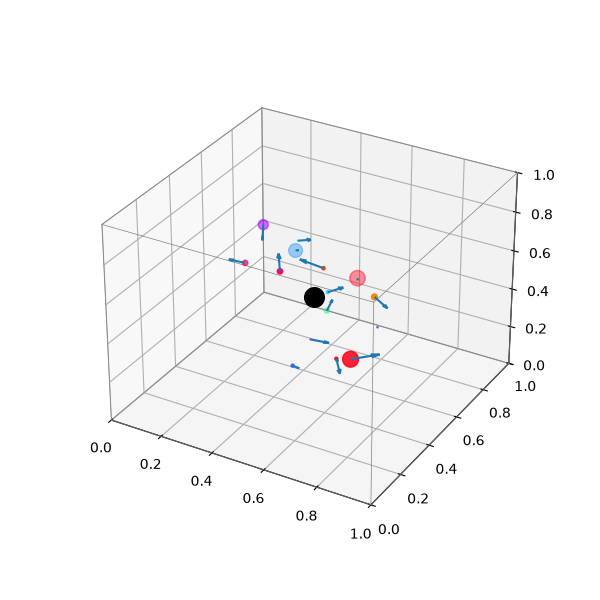
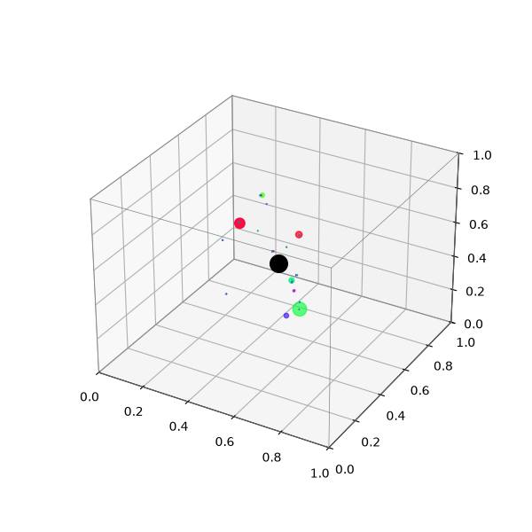
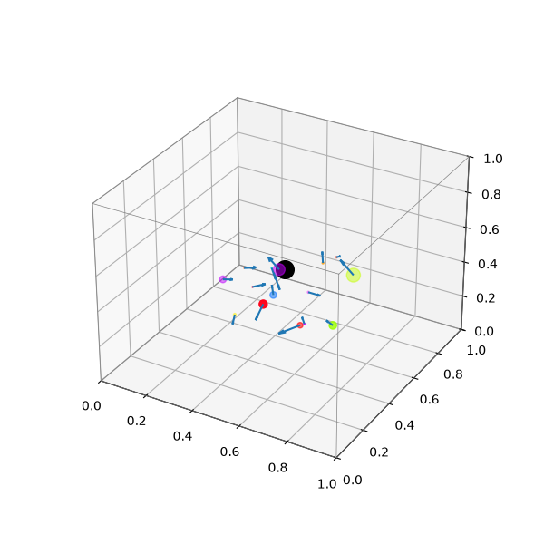
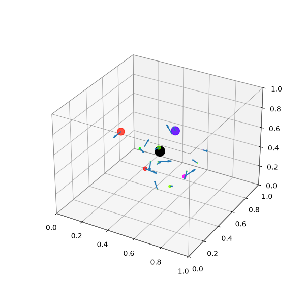
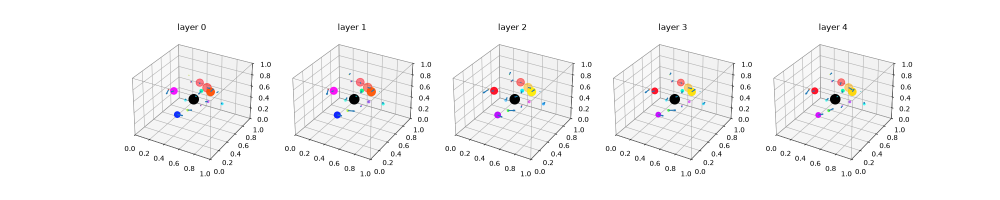
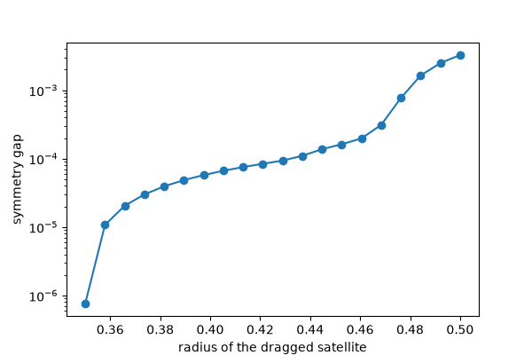

# Spin_GNN

The weights are small on purpose. The foundation is the work.

A small SO(3)-equivariant graph network with one controller node and sixteen
spinning satellites in a unit cube, with every symmetry claim stated as a
proposition, proved, and property-tested.

## Status

2026-09-11, session 8 on the local branch, 182 tests, `pytest -q` passes. The
`full` configuration has 818979 parameters.

## What this is

One controller node sits at the center of a unit cube and sixteen satellites
spin around it, each carrying a position, an axis, a phase, and a spin speed.
Four equivariant message-passing layers move invariant scalars and equivariant
vectors between the satellites and the controller. A set of predicates reads
the rigid state and feeds nothing back into the loss. The composition claim is
that stacking invariant packets with equivariant messages keeps the whole model
SO(3)-equivariant on the interior; every component is inherited from the cited
equivariant and set-function work.

## Propositions

| Prop | Claim | Test | Status |
|---|---|---|---|
| 1 | packet is SO(3)-invariant about the controller | test_invariance.py::test_packet_invariant | verified |
| 2 | message is SO(3)-equivariant | test_message.py | verified |
| 3 | full model is SO(3)-equivariant on the interior U | test_invariance.py, test_equivariance.py, diagnostics | verified at init; the trained full model steps past the bound, see MATH.md |
| 4 | full model is exactly O-equivariant everywhere | test_equivariance.py | verified |
| 5 | phi is a scalar, not a geometric spin, in v0 | docs only | docs only |
| 6 | parity of omega is undeclared under reflections | docs only | out of scope |
| 7 | phase update is the exact constant-speed flow | test_phase_wrap.py::test_closed_form | verified |
| 8 | scalar path separates a distance-degenerate pair | test_expressivity.py | verified |

## Session 8: the model fix

Session 7 measured the equivariant model at 0.7502 on Task B against
0.9202 for the width-matched DeepSets baseline. A per-class confusion
matrix showed the model separating classes 0 and 1 inside 150 steps and
never separating class 2 from class 3, which differ by one aligned axis
pair among 120 edges. Mean aggregation carries that edge at weight 1/16.
Session 8 adds gaussian grids over the distance and alignment columns
(SchNet), max and softmax-attention aggregation beside the mean at the
satellites and at the controller (principal neighbourhood aggregation),
the PaiNN gated equivariant block with channel mixing and per-channel
vector invariants, layer norm on every scalar MLP input, one forward per
step, warmup plus cosine learning-rate decay with gradient clipping, and
a cached deterministic Task B stream per seed. Prop 9 in `docs/MATH.md`
proves the new maps keep the symmetry, and `test_basis.py` covers them.
The plan for the next sessions is in `docs/PLAN.md`. The table below is
the session 8 measurement with the rebuilt model.

## Task B ablation

Five seeds, 4000 steps each, held out set of 2000, evaluated every 50 steps.
The milestone is the first evaluation at or above 0.90 held-out accuracy.

| run | params | heldout mean | heldout 95% CI | steps to 0.90 mean | steps to 0.90 95% CI | missing | sec per step |
|---|---|---|---|---|---|---|---|
| full | 818979 | 1.0000 | [1.0000, 1.0000] | 160.0 | [130.0, 190.0] | 0 | 0.5130 |
| static | 818979 | 1.0000 | [1.0000, 1.0000] | 160.0 | [150.0, 180.0] | 0 | 0.4352 |
| scalar_only | 818979 | 1.0000 | [1.0000, 1.0000] | 160.0 | [150.0, 180.0] | 0 | 0.4345 |
| baseline | 819789 | 0.9554 | [0.9522, 0.9579] | 2170.0 | [2030.0, 2310.0] | 0 | 0.4297 |

paired steps-to-milestone difference (full - scalar_only) over 5 paired seeds: mean 0.0, 95% CI [-50.0, 40.0].

Every Spin_GNN configuration reaches a held-out accuracy of 1.0000 on every
seed, and every one of the fifteen runs reaches the 0.90 milestone between
step 100 and step 200. The width-matched DeepSets baseline reaches 0.9554 and
needs about 2170 steps, and its weakest class is class 2 on every seed, the
class that needs one aligned pair found among 120 edges. Session 7 measured
the same equivariant model at 0.7502 and the same baseline at 0.9202.

The paired interval crosses zero: on five paired seeds the full model reached
the milestone at the same evaluation as the scalar-only model, one evaluation
earlier once, and one evaluation later once. So the geometric updates neither
speed up nor slow down Task B. That is the expected reading for a set
function, and it is why the next session moves to tasks D and E, where the
satellites have to move for the label to be right.

### The four constructed classes

Each panel is one unit cube with the controller at its center and sixteen
satellites, drawn as axis lines colored and sized by spin speed. The labeler
applies its rules in a fixed order: fewer than three near satellites means
class 0; otherwise mean spin speed below the threshold means class 1; otherwise
at least one aligned axis pair means class 2; anything left is class 3.



*Class 0: sparse near the controller. Two or fewer satellites sit near the
center, so the rest scatter across the cube. Under uniform sampling about 0.915
of draws land here, which is the imbalance the constructor is built to break.*



*Class 1: near but slow spinning. Three or more satellites sit near the
controller and the mean spin speed stays under the threshold. Uniform sampling
almost never produces it: its frequency is 0.0.*



*Class 2: near, fast, and aligned. Three or more near satellites spin fast and
at least one pair of axes is nearly parallel. Aligned axes are rare by chance,
so this class is also near-absent under uniform draws.*



*Class 3: near, fast, and unaligned. Three or more near satellites spin fast
with every axis pointing a different way. The constructor packs sixteen
non-aligned axes to reach it; uniform sampling never does.*

The constellation as the layers see it, one 3D panel per layer boundary from
the encoder output through layer 4:



*Five panels, encoder output then layers 1 through 4, each drawing one
constellation with satellites colored by phase phi. The satellites hold their
relative positions as the layers pass, which is the geometric state the
equivariant stack preserves while the scalar path reads the Task B signal.*

## Class frequencies under uniform sampling

Uniform sampling places 0.91525 of draws in class 0, 0.0 in class 1, 0.08475 in
class 2, and 0.0 in class 3. The constructed generator is the dataset because
the uniform draw never produces classes 1 and 3, so the constructor builds the
near ring and the far ring explicitly to give Task B a flat prior.

## Where symmetry stops

Prop 4 says the box projection commutes only with isometries that map the cube
to itself, so the model is exactly equivariant under the 24 cube rotations and
breaks for a generic rotation once a satellite touches a wall.



*The symmetry gap as six satellites are dragged from the interior radius out
to the six wall centers, with the position step inflated so the clip is
visible. The gap starts near 1e-6 and climbs three orders of magnitude as the
satellites reach the walls and the projection fires. This is the measured
boundary of the Prop 4 claim; the figure is redrawn by the ablation.*

## Limitations

phi is a scalar, not a geometric spin. Reflections are untested. Task B is a set
function, so the ablation measures efficiency, not necessity. The ablation runs
on CPU only. N is fixed at 16.

## Run

```bash
pip install -e ".[dev]"
pytest -q
python -m spin_gnn.train.ablate --seeds 5 --steps 4000 --out results
python -m spin_gnn.train.ablate --smoke
```

## Citations

The works below are cited inline in the code and docs.

1. M. Boutin and G. Kemper, On reconstructing n-point configurations from the
   distribution of distances or areas, Advances in Applied Mathematics, 2004.
   The homometric line pair that witnesses Prop 8.
2. A. Pozdnyakov et al., Incompleteness of graph neural networks for points
   clouds in three dimensions, 2020. Three-dimensional homometric constructions
   noted as an alternative Prop 8 witness.
3. M. Zaheer, S. Kottur, S. Ravanbakhsh, B. Poczos, R. Salakhutdinov, and
   A. Smola, Deep Sets, 2017. The width-matched baseline in the Task B ablation.
4. K. T. Schütt, P.-J. Kindermans, H. E. Sauceda, S. Chmiela, A. Tkatchenko,
   and K.-R. Müller, SchNet: a continuous-filter convolutional neural network
   for modeling quantum interactions, 2017. The gaussian grid over distances.
5. G. Corso, L. Cavalleri, D. Beaini, P. Liò, and P. Veličković, Principal
   Neighbourhood Aggregation for Graph Nets, 2020. Mean, max, and attention
   side by side as aggregators.
6. K. Xu, W. Hu, J. Leskovec, and S. Jegelka, How Powerful are Graph Neural
   Networks?, 2019. What mean and max can and cannot distinguish.
7. K. T. Schütt, O. T. Unke, and M. Gastegger, Equivariant message passing
   for the prediction of tensorial properties and molecular spectra, 2021.
   The PaiNN gated equivariant block and the vector invariants.
8. P. Thölke and G. De Fabritiis, Equivariant Transformers for Neural
   Network based Molecular Potentials, 2022. Invariant attention weights
   over equivariant messages.
9. J. L. Ba, J. R. Kiros, and G. E. Hinton, Layer Normalization, 2016.
10. I. Loshchilov and F. Hutter, SGDR: Stochastic Gradient Descent with Warm
    Restarts, 2017, and Decoupled Weight Decay Regularization, 2019. The
    cosine schedule and AdamW.
11. G. Li, C. Xiong, A. Thabet, and B. Ghanem, DeeperGCN: All You Need to
    Train Deeper GCNs, 2020. The softmax aggregator with a learned
    temperature.

[](https://creativecommons.org/licenses/by-nc-nd/4.0/)
